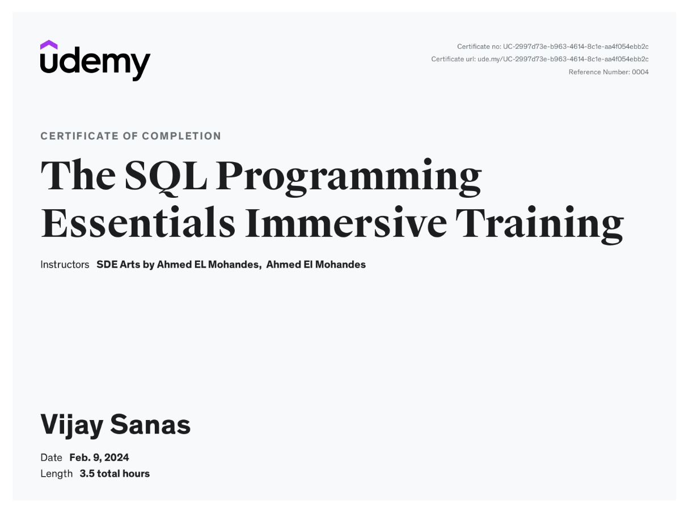

# SQL-Programming-Essentials_Udemy-Certificate
---
This repository highlights my achievement in completing the **SQL Programming Essentials Immersive Training** course. This course was offered by **Udemy** and instructed by **SDE Arts by Ahmed El Mohandes** and **Ahmed El Mohandes**. 

## Certification Details
- **Certificate Title:** SQL Programming Essentials Immersive Training
- **Awarded By:** Udemy
- **Instructors:** SDE Arts by Ahmed El Mohandes, Ahmed El Mohandes
- **Date of Completion:** February 9, 2024
- **Course Duration:** 3.5 Total Hours
- **Certificate URL:** [View Certificate](https://ude.my/UC-2997d73e-b963-4614-8c1e-aa4f054ebb2c)
- **Certificate Number:** UC-2997d73e-b963-4614-8c1e-aa4f054ebb2c

## Key Learnings
During this course, I developed a strong foundation in SQL programming, including:
1. **Core SQL Concepts:** Mastering the basics of SQL syntax, data manipulation, and querying techniques.
2. **Database Operations:** Writing efficient SQL queries to retrieve, filter, and aggregate data from relational databases.
3. **Practical Applications:** Applying SQL skills to solve real-world problems in database management and analysis.
